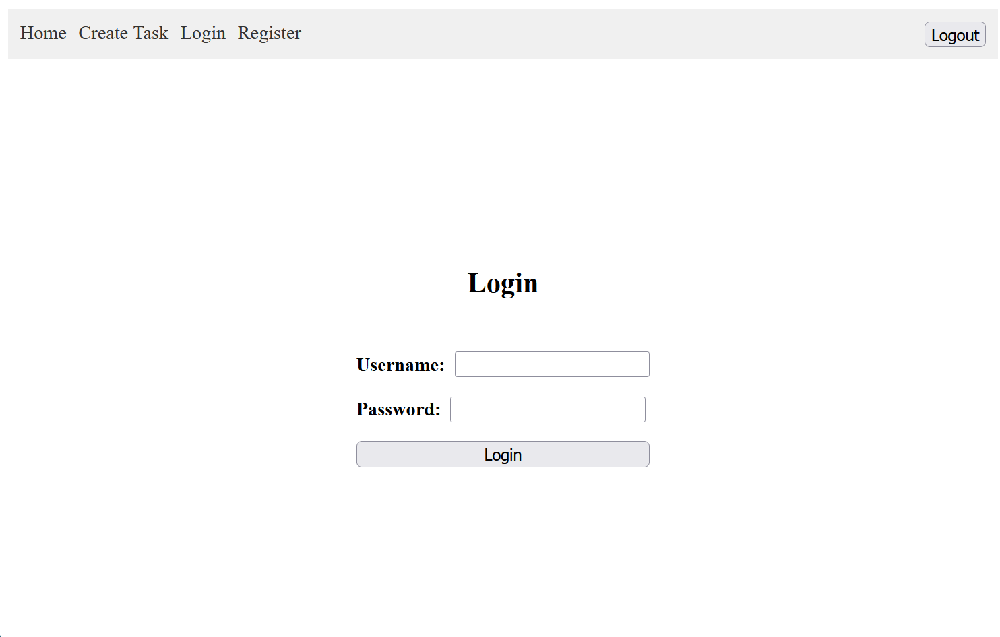
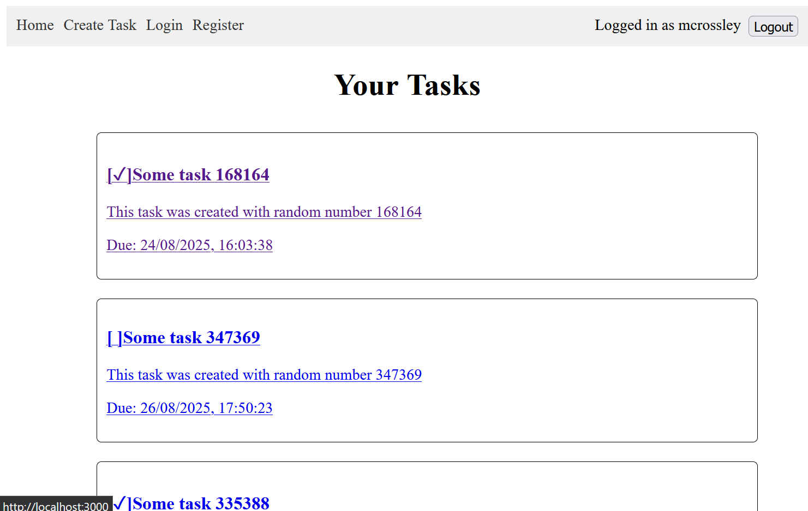
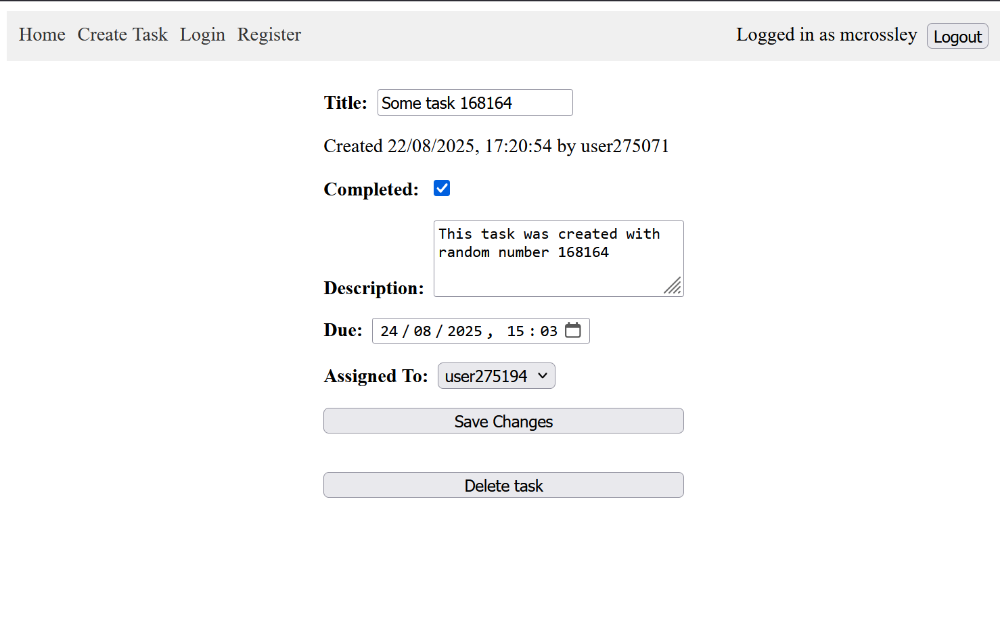

# Simple To-Do List App

Simple app that tracks tasks for different users.

## Setup

You will need Python>=3.10 and a recent version of NodeJS installed.

```bash
cd frontend
npm install
cd ../backend
pip install -r requirements.txt
```

If you want to isolate the installation of the Python dependencies, you can do that in a venv. Run these commands beforehand to set that up:

```powershell
python -m venv .venv
.\venv\Scripts\activate  # or `source .venv/bin/activate` on linux/mac
```

## Running the application

You will need to run the frontend and backend in separate terminal windows.

To run the frontend:

```bash
cd frontend
npm run start
```

And the backend:
```bash
cd backend
python -m fastapi run src/main.py
```

## Usage

On first load, you will be greeted by the login screen. You can also register a new user by navigating to that page on the nav bar. On the registration page you can also choose whether to create an admin user, who will have additional rights.

You won't be able to access the rest of the application without being logged in.



Once logged in, you will see a number of tasks. These have been automatically generated on startup as examples.

You can click on a task to view/edit it, or create a new task via the "Create Task" button on the nav bar.

Note that you can only edit/delete tasks that you have created, unless you're an admin user.




You can give each task a title, description and due date, as well as assigning it to another user.

Input validation has been implemented using Pydantic.

## Testing

You can run the unit tests using the following commands:

```bash
cd backend
pip install -r requirements-dev.txt
pytest
```

These tests are not exhaustive and do not hit 100% coverage, but the backend is very simple and doesn't have that much logic to test. These cover the most important backend logic and some edge cases.

## API Documentation

API docs are generated by FastAPI and are available at <http://localhost:8000/docs> when running the backend.
